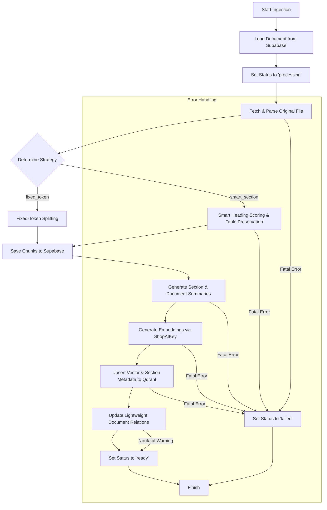
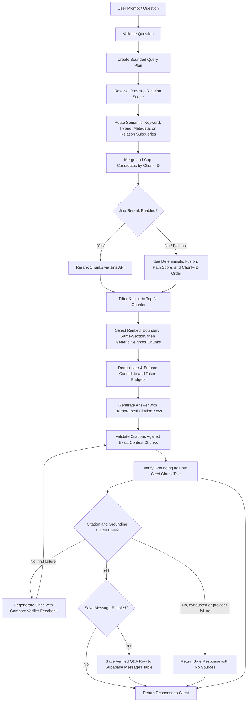
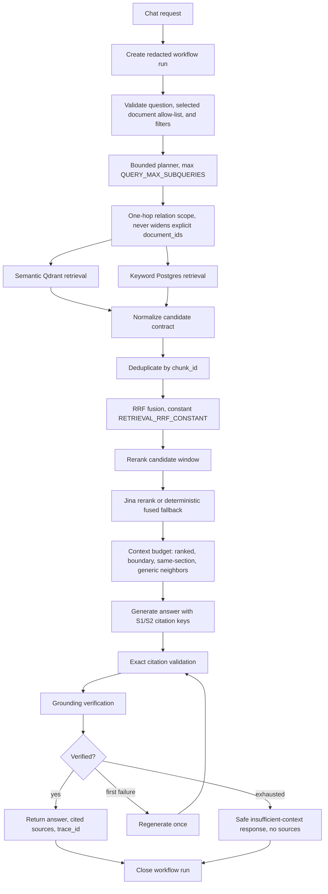

# RagDocument

RagDocument is a personal, single-user document Retrieval-Augmented Generation (RAG) application. It features a robust Python FastAPI backend leveraging LangGraph for orchestration, Supabase for file storage and metadata, Qdrant as a vector database, ShopAIKey for language models, and Jina AI for state-of-the-art reranking. The UI is built using React, Vite, and TypeScript.

---

## Table of Contents
1. [System Architecture](#system-architecture)
2. [Key Features](#key-features)
3. [Technology Stack](#technology-stack)
4. [Database Schema](#database-schema)
5. [Directory Structure](#directory-structure)
6. [Configuration & Environment Variables](#configuration--environment-variables)
7. [Installation & Setup](#installation--setup)
8. [Query & Retrieval Architecture](#query--retrieval-architecture)
9. [System Settings](#system-settings)
10. [Testing & Verification](#testing--verification)

---

## System Architecture

RagDocument utilizes **LangGraph** to model stateful multi-step pipelines for document ingestion and retrieval queries.

### 1. Ingestion Pipeline
When a document is uploaded, it transitions through the ingestion graph to process raw content into vector embeddings.



### 2. Retrieval & Query Pipeline
When a user asks a question, the query workflow creates a bounded typed plan, routes each subquery through its allowed retrieval paths, merges the candidates, applies independent candidate and reranking caps, and continues through token-budgeted context selection and generation.



---

## Key Features

### Backend Capabilities
- **FastAPI Core**: A typed settings layer managed via Pydantic and secured through optional `X-Admin-API-Token` validation (configured on demand via `ADMIN_API_TOKEN`).
- **Unified Document Parsing**: Normalized parser registry ([backend/app/parsing/](file:///C:/Users/ACER/OtherProjects/DocumentAgent/backend/app/parsing)) supporting PDF, DOCX, TXT, Markdown, and HTML format parsing. The parser extracts hierarchical structures such as headings, paragraphs, bullet lists, blockquotes, code, and tables.
- **Smart Section Chunking**: Dynamic, structural chunking strategy ([backend/app/chunking/](file:///C:/Users/ACER/OtherProjects/DocumentAgent/backend/app/chunking)) utilizing heading scoring to preserve section hierarchies and keep tables intact, falling back to fixed-token boundaries only when structural components exceed length limits.
- **Section-Aware Retrieval**: Context retrieval selects final ranked chunks first, then requested boundary chunks, exact same-section neighbors, and generic same-document neighbors (`RETRIEVAL_CONTEXT_MODE=section_aware`), while enforcing candidate and token budgets.
- **Metadata-Aware Hybrid Retrieval**: Chat requests can filter by document allow-list, MIME type, heading, section path, and page range; semantic Qdrant retrieval and Postgres full-text keyword retrieval run independently and merge candidates with reciprocal-rank fusion.
- **Bounded Candidate Stages and Reranking**: Retrieval enforces per-path, fused, rerank-candidate, final-reranked, and context-stage caps independently. Disabled or invalid reranking falls back deterministically by fusion score, path scores, and chunk ID.
- **Bounded Query Planning and Routing**: The query graph normalizes and caps planned subqueries, routes semantic, keyword, hybrid, metadata, and one-hop relation strategies through approved paths, and merges candidates.
- **Exact Citations and Grounding Gate**: Generated answers use prompt-local `S1`, `S2` citation keys that map back to exact context chunk IDs. Returned sources are limited to cited chunks, factual answers must pass citation validation plus grounding verification against cited chunk text, and failed verification triggers a single regeneration attempt.
- **Document Summaries**: Ingestion generates section and document summaries, stores exact source chunk IDs, replaces summaries atomically after complete generation, and exposes them via `GET /api/documents/{document_id}/summaries`.
- **Lightweight Document Relations**: Ingestion builds evidence-backed, canonical document relations from summary embedding search and exposes them via `GET /api/documents/{document_id}/relations`.
- **Workflow Observability**: Ingestion and query workflows create redacted trace runs with node timing, attempts, counts, routes, fallbacks, safe error codes, and aggregate retrieval metrics, inspectable via `/api/observability/runs`.
- **Bounded Failure Recovery**: Retryable timeout, connection, HTTP 429, and HTTP 5xx failures use exponential retries across storage, model, database, vector, rerank, and delete operations.

### Frontend Capabilities
- **React Vite TypeScript Frontend**: Quick build time and typed API integrations. Secret keys remain strictly on the server-side.
- **Document Management Console**: Browser UI for file upload, status polling, details inspection, reindexing, and full deletion cleanups (removes from database, storage bucket, and vector store).
- **Advanced Chat Interface**:
  - Selection of target documents for focused queries.
  - Collapsible retrieval filters for MIME/file type, heading, section path, and page range.
  - Contextual citation rendering (both page-present e.g., `[Doc, p. 3]` and page-absent e.g., `[Doc]` styles).
  - Optional retrieval metadata display for fusion score, retrieval paths, and citation key when available.
  - Multi-chunk navigation drawer (browse preceding or succeeding adjacent source chunks directly in the browser).
  - Single-click restore of old messages and sources into the active chat session.

---

## Technology Stack

- **Backend Framework**: Python 3.12, FastAPI, Uvicorn, Pydantic v2
- **Orchestration**: LangGraph, LangChain Community
- **Primary Database (Relational & Blob)**: Supabase (PostgreSQL & Storage Bucket)
- **Vector Database**: Qdrant
- **LLM & Embeddings Provider**: ShopAIKey API (`gpt-4o-mini`, `text-embedding-3-small`)
- **Reranker API**: Jina AI (`jina-reranker-v2-base-multilingual`)
- **Frontend Framework**: React 18, Vite, TypeScript, Vanilla CSS

---

## Database Schema

Applied database definitions are tracked in [docs/database/supabase_schema.sql](docs/database/supabase_schema.sql):

### 1. `documents` Table
Tracks global status, file characteristics, and parsing configuration.

| Field Name | Type | Description |
| :--- | :--- | :--- |
| `id` | `uuid` (PK) | Unique document identifier. |
| `title` | `text` | Document title (defaults to file name). |
| `file_name` | `text` | Raw uploaded file name. |
| `mime_type` | `text` | Detected MIME type (e.g., `application/pdf`, `text/html`). |
| `file_size` | `bigint` | Byte size of the file. |
| `file_hash` | `text` (Unique) | SHA-256 hash of file content. |
| `storage_path` | `text` | Reference to the file in Supabase Storage. |
| `status` | `text` | `uploaded`, `processing`, `ready`, or `failed`. |
| `total_pages` | `int` | Total pages in the document. |
| `total_chunks` | `int` | Number of chunks generated. |
| `parser_name` | `text` | Parser engine used. |
| `chunking_strategy` | `text` | Configured chunking type (e.g., `smart_section`). |
| `qdrant_collection` | `text` | The Qdrant collection vectors are saved to. |
| `error_message` | `text` | Capture of fatal ingestion exception details. |
| `error_code` | `text` | Stable optional failure code for ingestion errors. |

### 2. `document_chunks` Table
Stores parsed texts and layout metadata.

| Field Name | Type | Description |
| :--- | :--- | :--- |
| `id` | `uuid` (PK) | Unique chunk ID. |
| `document_id` | `uuid` (FK) | Reference to `documents.id` (on delete cascade). |
| `chunk_index` | `int` | Sequential chunk index. |
| `content` | `text` | Raw textual content. |
| `token_count` | `int` | Computed token length. |
| `heading` | `text` | Section heading the chunk belongs to. |
| `section_path` | `jsonb` | JSON list of parent headings leading to the chunk. |
| `page_start` / `page_end` | `int` | Page coverage details. |
| `qdrant_point_id` | `text` | Link to the corresponding point in Qdrant. |

### 3. `messages` Table
Maintains historical chat interactions.

| Field Name | Type | Description |
| :--- | :--- | :--- |
| `id` | `uuid` (PK) | Message ID. |
| `question` | `text` | Question queried by the user. |
| `answer` | `text` | Synthesized grounded answer. |
| `sources` | `jsonb` | References array including headings, page ranges, and previews. |
| `metadata` | `jsonb` | Runtime configurations and retrieval metrics. |

### 4. Derived Data & Telemetry Tables
The schema includes persistence tables for summaries, document relations, and tracing events:
- **`document_summaries`**: Stores section and document summaries keyed by section path.
- **`document_relations`**: Stores evidence-backed document relations with confidence scores.
- **`workflow_runs`**: Stores ingestion and query workflow trace metrics and timings.

### 5. Postgres Keyword Search Index
A language-neutral Postgres full-text GIN index is defined over chunk headings/content, queried through the `search_document_chunks_keyword` RPC to provide database-level keyword retrieval.

---

## Directory Structure

```
RagDocument/
├── backend/
│   ├── app/
│   │   ├── api/             # API Router definitions (/health, /documents, /chat, /messages)
│   │   ├── chunking/        # Heading scoring and smart-section chunkers
│   │   ├── core/            # Configuration setting loader (Pydantic Settings)
│   │   ├── evaluation/      # Versioned RAG evaluation dataset, metrics, and runner
│   │   ├── graphs/          # LangGraph ingestion and query workflow graphs
│   │   │   ├── query_steps/     # Decoupled query pipeline step implementations
│   │   │   ├── ingestion_steps/ # Decoupled ingestion pipeline step implementations
│   │   │   ├── query_nodes.py   # Compatibility facade wrapper for query nodes
│   │   │   └── ingestion_nodes.py # Compatibility facade wrapper for ingestion nodes
│   │   ├── models/          # SQLAlchemy or Pydantic models
│   │   ├── parsing/         # Extensible document parsers (PDF, DOCX, TXT, MD, HTML)
│   │   ├── rag/             # Shared RAG prompts and formatting utilities
│   │   │   ├── prompts.py       # Decoupled query planning and generation prompts
│   │   │   └── formatting.py    # Decoupled citation rendering and metadata formatting
│   │   ├── services/        # Decoupled backend service utilities and facades
│   │   │   ├── retrieval.py              # Main retrieval facade preserving public APIs
│   │   │   ├── retrieval_normalization.py # Retrieval response and metadata normalization
│   │   │   ├── retrieval_filters.py       # Qdrant metadata and page filter helpers
│   │   │   ├── semantic_retrieval.py      # Qdrant semantic search operations
│   │   │   └── reranking.py               # Jina reranking integration
│   │   └── main.py          # FastAPI application entry point
│   ├── tests/               # pytest test cases covering graphs, chunkers, and APIs
│   ├── evaluation/          # Text-only evaluation fixtures, datasets, and ignored result reports
│   ├── pyproject.toml
│   └── README.md            # Backend environment and local activation guides
├── docs/
│   └── database/
│       └── supabase_schema.sql  # SQL schema migrations
├── frontend/
│   ├── src/
│   │   ├── api/             # Frontend client communicating with API routes
│   │   ├── components/      # UI components (Chat, Upload, History)
│   │   ├── App.tsx          # Main React Application
│   │   └── styles.css       # Core styling definitions
│   ├── tsconfig.json
│   └── vite.config.ts
└── README.md                # Root project entry point
```

---

## Configuration & Environment Variables

Copy `backend/.env.example` to `backend/.env`, then replace the service placeholders with your Supabase, Qdrant, ShopAIKey, and Jina values. [backend/.env.example](file:///C:/Users/ACER/OtherProjects/DocumentAgent/backend/.env.example) is the single active reference for backend environment variables.

---

## Installation & Setup

### Prerequisite External Resources
1. **Supabase Database**: Create a Supabase project, open the SQL editor, then execute the full contents of [docs/database/supabase_schema.sql](docs/database/supabase_schema.sql).
2. **Supabase Bucket**: Create a private storage bucket named `documents` (or matching `SUPABASE_STORAGE_BUCKET`).
3. **Qdrant**: Docker Compose starts local Qdrant and creates the default `document_chunks_v1` collection automatically. If you deploy without Docker, create the collection yourself with vector size `1536` for `text-embedding-3-small`.

### Docker Launch
Docker is the simplest way for another person to run the project. Docker starts the app and local Qdrant, but it does not auto-migrate Supabase. Users must run the tracked Supabase SQL file once in their own Supabase project.

```powershell
git clone https://github.com/YOUR_NAME/DocumentAgent.git
cd DocumentAgent
copy backend\.env.example backend\.env
```

In Supabase:

1. Create a new Supabase project.
2. Open **SQL Editor**.
3. Open [docs/database/supabase_schema.sql](docs/database/supabase_schema.sql) from this repo.
4. Copy the full SQL contents into Supabase SQL Editor and run it.
5. Open **Storage** and create a private bucket named `documents`.

Then edit `backend/.env` and set the external service credentials:

```env
SUPABASE_URL=https://your-project.supabase.co
SUPABASE_SERVICE_ROLE_KEY=your-supabase-service-role-key
SUPABASE_STORAGE_BUCKET=documents

SHOPAIKEY_API_KEY=your-shopaikey-token
JINA_API_KEY=your-jina-token
```

Docker Compose supplies the Docker-specific values for `FRONTEND_ORIGIN`, `QDRANT_URL`, `QDRANT_API_KEY`, and `QDRANT_COLLECTION`, so users do not need to edit those for the default local Docker setup.

Start the app:

```powershell
docker compose up --build
```

Open the frontend at:

```text
http://localhost:8080
```

The Compose file starts three services:
- `frontend`: Nginx serving the built React app and proxying `/api` to the backend.
- `backend`: FastAPI reading all runtime settings from `backend/.env`.
- `qdrant`: Local vector database with a persistent Docker volume.

`qdrant-init` creates the default `document_chunks_v1` collection with vector size `1536`, matching `text-embedding-3-small`. If you change the embedding model to one with a different dimension, delete the `qdrant_data` Docker volume or create a new collection name with the correct dimension.

### Backend Launch
Run the backend with Python 3.12 from the root folder:

```powershell
cd backend
python -m venv .venv
.\.venv\Scripts\Activate.ps1
pip install -e ".[dev]"
uvicorn app.main:app --reload --port 8000
```

### Frontend Launch
Launch the React application:

```powershell
cd frontend
npm install
npm run dev -- --host 127.0.0.1 --port 5173
```

Ensure `FRONTEND_ORIGIN` in your backend `.env` matches the frontend deployment address (`http://127.0.0.1:5173` or `http://localhost:5173`) to satisfy CORS configurations.

---

## Query & Retrieval Architecture



Trace persistence stores node names, status, attempts, timing, providers, counts, routes, fallbacks, safe error codes, retrieval totals, citation validity, grounding score, and total latency. It does not persist raw chunk text, parsed text, prompts, full model responses, full generated answers, authorization headers, API keys, or credential-bearing URLs.

---

## System Settings

| Setting | Default | Description |
| :--- | :--- | :--- |
| `ENABLE_KEYWORD_SEARCH` | `true` | Enables Postgres keyword retrieval for hybrid search. |
| `RETRIEVAL_KEYWORD_TOP_K` | `40` | Keyword candidates requested from SQL. |
| `RETRIEVAL_FUSION_TOP_K` | `40` | Fused candidates kept after RRF. |
| `RETRIEVAL_RRF_CONSTANT` | `60` | Reciprocal-rank fusion constant. |
| `RETRIEVAL_RERANK_CANDIDATE_TOP_K` | `20` | Candidates sent to Jina. |
| `RETRIEVAL_CONTEXT_MAX_TOKENS` | `4000` | Token budget for generation context. |
| `QUERY_MAX_SUBQUERIES` | `4` | Maximum planner subqueries. |
| `QUERY_PLANNER_TEMPERATURE` | `0.0` | Planner model temperature. |
| `QUERY_PLANNER_MAX_TOKENS` | `500` | Planner output cap. |
| `ENABLE_SUMMARIES` | `true` | Generates section and document summaries during indexing. |
| `SUMMARY_SECTION_MAX_TOKENS` | `200` | Section-summary model cap. |
| `SUMMARY_DOCUMENT_MAX_TOKENS` | `400` | Document-summary model cap. |
| `ENABLE_RELATION_RETRIEVAL` | `true` | Enables relation generation and relation-aware query scope. |
| `RELATION_MAX_RELATED_DOCUMENTS` | `5` | Maximum one-hop related documents. |
| `GROUNDING_MIN_SCORE` | `0.80` | Minimum verifier score for factual answers. |
| `GROUNDING_MAX_REGENERATIONS` | `1` | Bounded answer regeneration count. |
| `WORKFLOW_MAX_ATTEMPTS` | `3` | Attempts for retryable external operations. |
| `WORKFLOW_RETRY_BASE_DELAY_SECONDS` | `0.25` | Initial retry backoff. |
| `WORKFLOW_RETRY_MAX_DELAY_SECONDS` | `2.0` | Maximum retry backoff. |
| `ENABLE_WORKFLOW_TRACING` | `true` | Enables trace persistence. |

---

## Testing & Verification

### 1. Run Docker Health Check
After starting Docker Compose, confirm the API is reachable through the frontend proxy:

```powershell
docker compose up --build
Invoke-RestMethod http://localhost:8080/api/health
```

Expected response:

```json
{"status":"ok"}
```

### 2. Run Frontend Build Check
Ensure TypeScript and production bundling complete successfully:

```powershell
cd frontend
npm run build
```
