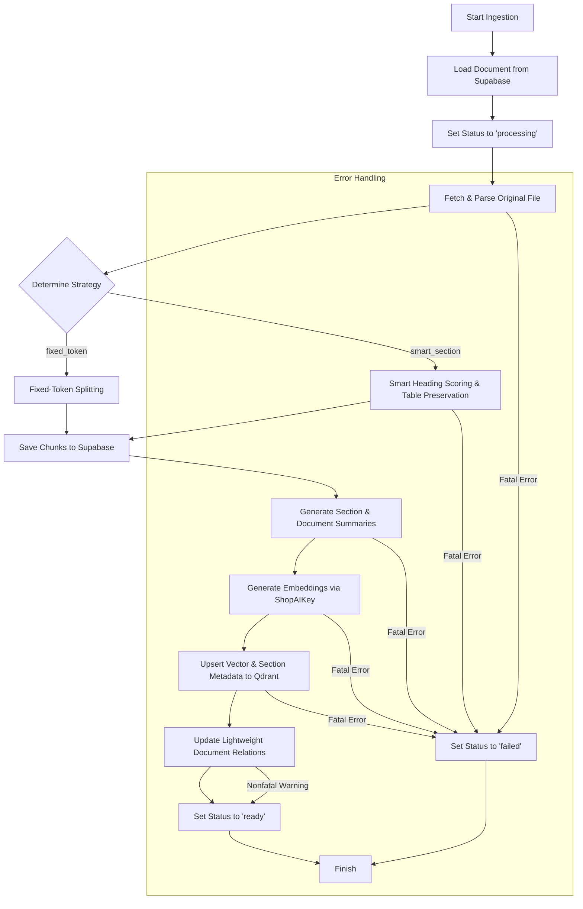
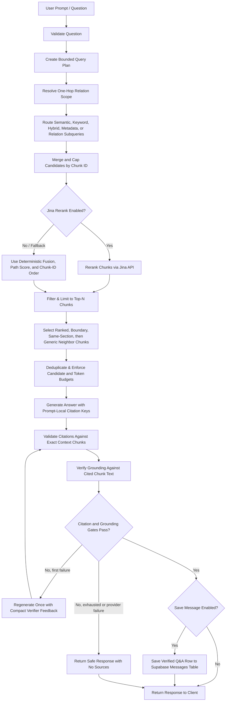
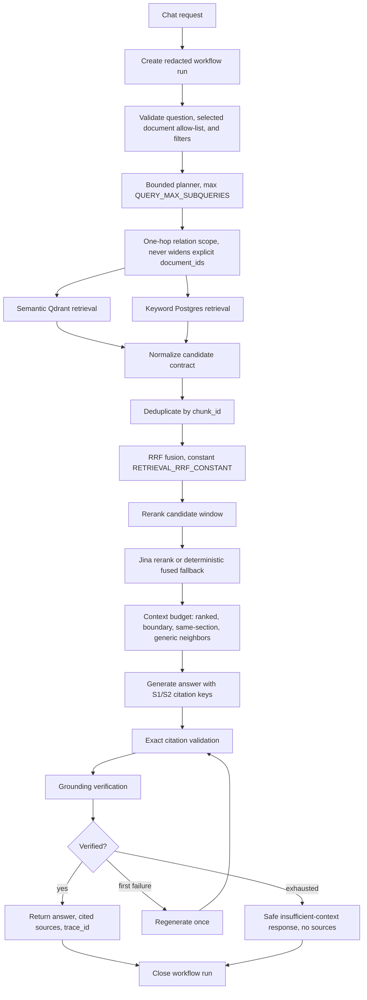

# RagDocument

RagDocument is a personal, single-user document Retrieval-Augmented Generation (RAG) application. It features a robust Python FastAPI backend leveraging LangGraph for orchestration, Supabase for file storage and metadata, Qdrant as a vector database, ShopAIKey for language models, and Jina AI for state-of-the-art reranking. The UI is built using React, Vite, and TypeScript.

---

## Table of Contents
1. [System Architecture](#system-architecture)
2. [Key Features](#key-features)
3. [Technology Stack](#technology-stack)
4. [Database Schema](#database-schema)
5. [Directory Structure](#directory-structure)
6. [Configuration & Environment Variables](#configuration--environment-variables)
7. [Installation & Setup](#installation--setup)
8. [Testing & Verification](#testing--verification)

---

## System Architecture

RagDocument utilizes **LangGraph** to model stateful multi-step pipelines for document ingestion and retrieval queries.

### 1. Ingestion Pipeline
When a document is uploaded, it transitions through the ingestion graph to process raw content into vector embeddings.



### 2. Retrieval & Query Pipeline
When a user asks a question, the query workflow creates a bounded typed plan, routes each subquery through its allowed retrieval paths, merges the candidates, applies independent candidate and reranking caps, and continues through token-budgeted context selection and generation.



---

## Key Features

### Backend Capabilities
- **FastAPI Core**: A typed settings layer managed via Pydantic and secured through optional `X-Admin-API-Token` validation (configured on demand via `ADMIN_API_TOKEN`).
- **Unified Document Parsing**: Normalized parser registry ([backend/app/parsing/](file:///C:/Users/ACER/OtherProjects/DocumentAgent/backend/app/parsing)) supporting PDF, DOCX, TXT, Markdown, and HTML format parsing. The parser extracts hierarchical structures such as headings, paragraphs, bullet lists, blockquotes, code, and tables.
- **Smart Section Chunking**: Dynamic, structural chunking strategy ([backend/app/chunking/](file:///C:/Users/ACER/OtherProjects/DocumentAgent/backend/app/chunking)) utilizing deterministic heading scoring to preserve section hierarchies and keep tables intact, falling back to fixed-token boundaries only when structural components exceed length limits.
- **Section-Aware Retrieval**: Context retrieval selects final ranked chunks first, then requested boundary chunks, exact same-section neighbors, and generic same-document neighbors (`RETRIEVAL_CONTEXT_MODE=section_aware`), while enforcing candidate and token budgets and preserving prompt-only truncation for oversized top chunks.
- **Metadata-Aware Hybrid Retrieval**: Chat requests can filter by document allow-list, MIME type, heading, section path, and page range; semantic Qdrant retrieval and Postgres full-text keyword retrieval run independently, recover from single-path failures, and merge candidates with deterministic reciprocal-rank fusion.
- **Bounded Candidate Stages and Reranking**: Retrieval enforces per-path, fused, rerank-candidate, final-reranked, and context-stage caps independently. Jina receives only the configured rerank candidate window, and disabled or invalid reranking falls back deterministically by fusion score, path scores, and chunk ID.
- **Bounded Query Planning and Routing**: The query graph normalizes and caps planned subqueries, preserves explicit document scope and filter precedence, routes semantic, keyword, hybrid, metadata, and one-hop relation strategies only through approved paths, and merges candidates while retaining subquery coverage.
- **Exact Citations and Grounding Gate**: Generated answers use prompt-local `S1`, `S2`, and later citation keys that map back to exact context chunk IDs. Returned sources are limited to cited chunks, factual answers must pass citation validation plus grounding verification against cited chunk text, and failed verification returns a safe no-source response after at most one regeneration.
- **RAG Evaluation Harness**: A versioned text-only evaluation corpus, deterministic fixture validator, production-query evaluation runner, timestamped JSON reports, and CLI quality gates measure retrieval recall/precision, rerank lift, no-result rates, citation validity, grounding pass rate, and answer term quality.
- **Deduplication & Validation**: Deterministic SHA-256 upload hashing prevent duplicate storage and indexing of identical documents.
- **Message History API**: Fast lookups for chat history from the `messages` table with bounded retrieval and failure isolation.
- **Phase 3 Contract Foundation**: Typed retrieval filters, planning/candidate/grounding/citation contracts, compact LangGraph state fields, and bounded Phase 3 settings are available for later advanced RAG batches.
- **Document Summaries**: Ingestion can generate extracted-text-only section and document summaries, store exact source chunk IDs, replace summaries atomically after complete generation, and expose typed `GET /api/documents/{document_id}/summaries` inspection.
- **Lightweight Document Relations**: Ingestion can build bounded, evidence-backed, canonical document relations from summary embedding search, keep relation failures nonfatal to valid indexing, and expose typed `GET /api/documents/{document_id}/relations` inspection with normalized related document IDs.
- **Phase 3 Persistence Foundation**: Idempotent SQL and lazy Supabase services provide document summaries, canonical document relations, and best-effort workflow trace storage.
- **Workflow Observability**: Ingestion and query workflows create compact, redacted trace runs with node timing, attempts, counts, routes, fallbacks, safe error codes, and aggregate retrieval metrics. Admin-token-protected `GET /api/observability/runs` and `GET /api/observability/runs/{run_id}` endpoints inspect traces without persisting prompts, source text, full answers, secrets, headers, or credential-bearing URLs.
- **Bounded Failure Recovery**: Retryable timeout, connection, HTTP 429, and HTTP 5xx failures use configured capped exponential retries across storage, model, database, vector, rerank, summary, relation, grounding, planner, and Qdrant delete operations. Contract, validation, unsupported file, missing document, and documented non-retryable 4xx failures run once, with deterministic planner, retrieval-path, rerank, grounding, message-persistence, ingestion, and relation-update fallbacks.

### Frontend Capabilities
- **React Vite TypeScript Frontend**: Quick build time and typed API integrations. Secret keys remain strictly on the server-side.
- **Document Management Console**: Browser UI for file upload, list status polling, details inspection, reindexing, and full deletion cleanups (removes from database, storage bucket, and vector store).
- **Advanced Chat Interface**:
  - Selection of target documents for focused queries.
  - Collapsible retrieval filters for MIME/file type, heading, section path, and page range, with invalid page ranges blocked before send.
  - Contextual citation rendering (both page-present e.g., `[Doc, p. 3]` and page-absent e.g., `[Doc]` styles).
  - Optional retrieval metadata display for fusion score, retrieval paths, and citation key when available.
  - Multi-chunk navigation drawer (browse preceding or succeeding adjacent source chunks directly in the browser).
  - Single-click restore of old messages and sources into the active chat session without needing to hit the LLM again.

---

## Technology Stack

- **Backend Framework**: Python 3.12, FastAPI, Uvicorn, Pydantic v2
- **Orchestration**: LangGraph, LangChain Community
- **Primary Database (Relational & Blob)**: Supabase (PostgreSQL & Storage Bucket)
- **Vector Database**: Qdrant
- **LLM & Embeddings Provider**: ShopAIKey API (`gpt-4o-mini`, `text-embedding-3-small`)
- **Reranker API**: Jina AI (`jina-reranker-v2-base-multilingual`)
- **Frontend Framework**: React 18, Vite, TypeScript, Vanilla CSS

---

## Database Schema

Applied database definitions are tracked in [docs/database/supabase_schema.sql](file:///C:/Users/ACER/OtherProjects/DocumentAgent/docs/database/supabase_schema.sql):

### 1. `documents` Table
Tracks global status, file characteristics, and parsing configuration.

| Field Name | Type | Description |
| :--- | :--- | :--- |
| `id` | `uuid` (PK) | Unique document identifier. |
| `title` | `text` | Document title (defaults to file name). |
| `file_name` | `text` | Raw uploaded file name. |
| `mime_type` | `text` | Detected MIME type (e.g., `application/pdf`, `text/html`). |
| `file_size` | `bigint` | Byte size of the file. |
| `file_hash` | `text` (Unique) | SHA-256 hash of file content. |
| `storage_path` | `text` | Reference to the file in Supabase Storage. |
| `status` | `text` | `uploaded`, `processing`, `ready`, or `failed`. |
| `total_pages` | `int` | Total pages in the document. |
| `total_chunks` | `int` | Number of chunks generated. |
| `parser_name` | `text` | Parser engine used. |
| `chunking_strategy` | `text` | Configured chunking type (e.g., `smart_section`). |
| `qdrant_collection` | `text` | The Qdrant collection vectors are saved to. |
| `error_message` | `text` | Capture of fatal ingestion exception details. |
| `error_code` | `text` | Stable optional failure code for migrated Phase 3 ingestion errors. |

### 2. `document_chunks` Table
Stores parsed texts and layout metadata.

| Field Name | Type | Description |
| :--- | :--- | :--- |
| `id` | `uuid` (PK) | Unique chunk ID. |
| `document_id` | `uuid` (FK) | Reference to `documents.id` (on delete cascade). |
| `chunk_index` | `int` | Sequential chunk index. |
| `content` | `text` | Raw textual content. |
| `token_count` | `int` | Computed token length. |
| `heading` | `text` | Section heading the chunk belongs to. |
| `section_path` | `jsonb` | JSON list of parent headings leading to the chunk. |
| `page_start` / `page_end` | `int` | Page coverage details. |
| `qdrant_point_id` | `text` | Link to the corresponding point in Qdrant. |

### 3. `messages` Table
Maintains historical interactions.

| Field Name | Type | Description |
| :--- | :--- | :--- |
| `id` | `uuid` (PK) | Message ID. |
| `question` | `text` | Question queried by the user. |
| `answer` | `text` | Synthesized grounded answer. |
| `sources` | `jsonb` | References array including headers, page ranges, and previews. |
| `metadata` | `jsonb` | Runtime configurations and retrieval metrics. |

### 4. Phase 3 Persistence Tables
Phase 3 adds compact derived-data and workflow telemetry storage:

| Table | Purpose |
| :--- | :--- |
| `document_summaries` | Stores one document summary per document and section summaries keyed by section path. |
| `document_relations` | Stores canonical, non-self document pairs with relation type, evidence chunk IDs, confidence, and model metadata. |
| `workflow_runs` | Stores ingestion/query workflow status, compact trace events, error codes, and timing metadata. |

### 5. Phase 3 Keyword Retrieval SQL
Phase 3 SQL also defines a language-neutral Postgres full-text GIN index over chunk heading/content and the `search_document_chunks_keyword` RPC. This RPC applies the same document, MIME, heading, section path, and page-overlap filters used by semantic retrieval, then returns deterministic keyword candidates for hybrid fusion.

---

## Directory Structure

```
RagDocument/
├── backend/
│   ├── app/
│   │   ├── api/             # API Router definitions (/health, /documents, /chat, /messages)
│   │   ├── chunking/        # Heading scoring and smart-section chunkers
│   │   ├── core/            # Configuration setting loader (Pydantic Settings)
│   │   ├── evaluation/      # Versioned RAG evaluation dataset, metrics, and runner
│   │   ├── graphs/          # LangGraph ingestion and query workflow graphs
│   │   ├── models/          # SQLAlchemy or Pydantic models
│   │   ├── parsing/         # Extensible document parsers (PDF, DOCX, TXT, MD, HTML)
│   │   ├── services/        # Lazy-initialization factories for DB & third-party services
│   │   └── main.py          # FastAPI application entry point
│   ├── tests/               # pytest test cases covering graphs, chunkers, and APIs
│   ├── evaluation/          # Text-only evaluation fixtures, datasets, and ignored result reports
│   ├── pyproject.toml
│   └── README.md            # Backend environment and local activation guides
├── docs/
│   └── database/
│       └── supabase_schema.sql  # SQL schema migrations
├── frontend/
│   ├── src/
│   │   ├── api/             # Frontend client communicating with API routes
│   │   ├── components/      # UI components (Chat, Upload, History)
│   │   ├── App.tsx          # Main React Application
│   │   └── styles.css       # Core styling definitions
│   ├── tsconfig.json
│   └── vite.config.ts
└── README.md                # Root project entry point
```

---

## Configuration & Environment Variables

Copy `backend/.env.example` to `backend/.env`, then replace the service placeholders with your Supabase, Qdrant, ShopAIKey, and Jina values. `backend/.env.example` is the single active reference for backend environment variables.

---

## Installation & Setup

### Prerequisite External Resources
1. **Supabase Database**: Execute the contents of [docs/database/supabase_schema.sql](file:///C:/Users/ACER/OtherProjects/DocumentAgent/docs/database/supabase_schema.sql) in your project's SQL editor.
   - Existing Phase 2 databases can apply [docs/database/phase3_migration.sql](file:///C:/Users/ACER/OtherProjects/DocumentAgent/docs/database/phase3_migration.sql) to add the Phase 3 column, persistence tables, keyword-search index, and keyword RPC when authorized for manual migration.
2. **Supabase Bucket**: Create a private storage bucket named `documents` (or matching `SUPABASE_STORAGE_BUCKET`).
3. **Qdrant Collection**: Initialize a collection named `document_chunks_v1` (matching `QDRANT_COLLECTION`). Ensure the vector size matches your embedding model's dimensions (1532 for `text-embedding-3-small` or standard default).

### Backend Launch
Run the backend with Python 3.12 from the root folder:

```powershell
cd backend
python -m venv .venv
.\.venv\Scripts\Activate.ps1
pip install -e ".[dev]"
uvicorn app.main:app --reload --port 8000
```

### Frontend Launch
Launch the React application:

```powershell
cd frontend
npm install
npm run dev -- --host 127.0.0.1 --port 5173
```

Ensure `FRONTEND_ORIGIN` in your backend `.env` matches the frontend deployment address (`http://127.0.0.1:5173` or `http://localhost:5173`) to satisfy CORS configurations.

---

## Phase 3 Upgrade and Operations

Phase 3 is a schema and index upgrade. Fresh projects and existing projects use different safe paths:

| Scenario | Required path |
| :--- | :--- |
| Fresh Supabase project | Run [docs/database/supabase_schema.sql](file:///C:/Users/ACER/OtherProjects/DocumentAgent/docs/database/supabase_schema.sql), then create the private Storage bucket and Qdrant collection. |
| Existing Phase 2 project | Back up the Supabase database, verify the target project, then apply [docs/database/phase3_migration.sql](file:///C:/Users/ACER/OtherProjects/DocumentAgent/docs/database/phase3_migration.sql) through an authorized SQL editor or migration path. |

The migration adds `documents.error_code`, `document_summaries`, `document_relations`, `workflow_runs`, the language-neutral keyword-search GIN index, and the `search_document_chunks_keyword` RPC. Do not run live migration or reindex operations against a project until the owner has confirmed the target resources and backup.

Existing documents must be reindexed after Phase 3 SQL is applied. Reindexing rebuilds chunks/vectors and populates Qdrant MIME payloads, extracted-text-only summaries, bounded relations, and Phase 3 metadata:

```http
POST /api/documents/{document_id}/reindex
```

Operational inspection endpoints:

| Method | Endpoint | Purpose |
| :--- | :--- | :--- |
| `GET` | `/api/documents/{document_id}/summaries` | Inspect stored section and document summaries. |
| `GET` | `/api/documents/{document_id}/relations` | Inspect bounded canonical document relations. |
| `GET` | `/api/observability/runs?workflow_type=&status=&limit=50` | List compact workflow traces; `limit` is clamped to `1..100`. |
| `GET` | `/api/observability/runs/{run_id}` | Inspect one workflow trace; unknown IDs return `404`. |

The observability endpoints require `X-Admin-API-Token` when `ADMIN_API_TOKEN` is configured. Keep `ADMIN_API_TOKEN` empty only for local/private use.

### Phase 3 Query Architecture



Trace persistence stores node names, status, attempts, timing, providers, counts, routes, fallbacks, safe error codes, retrieval totals, citation validity, grounding score, and total latency. It must not persist raw chunk text, parsed text, prompts, full model responses, full generated answers, authorization headers, API keys, or credential-bearing URLs.

### Phase 3 Settings

| Setting | Default | Description |
| :--- | :--- | :--- |
| `ENABLE_KEYWORD_SEARCH` | `true` | Enables Postgres keyword retrieval for hybrid search. |
| `RETRIEVAL_KEYWORD_TOP_K` | `40` | Keyword candidates requested from SQL. |
| `RETRIEVAL_FUSION_TOP_K` | `40` | Fused candidates kept after RRF. |
| `RETRIEVAL_RRF_CONSTANT` | `60` | Reciprocal-rank fusion constant. |
| `RETRIEVAL_RERANK_CANDIDATE_TOP_K` | `20` | Candidates sent to Jina. |
| `RETRIEVAL_CONTEXT_MAX_TOKENS` | `4000` | Token budget for generation context. |
| `QUERY_MAX_SUBQUERIES` | `4` | Maximum planner subqueries. |
| `QUERY_PLANNER_TEMPERATURE` | `0.0` | Planner model temperature. |
| `QUERY_PLANNER_MAX_TOKENS` | `500` | Planner output cap. |
| `ENABLE_SUMMARIES` | `true` | Generates section and document summaries during indexing. |
| `SUMMARY_SECTION_MAX_TOKENS` | `200` | Section-summary model cap. |
| `SUMMARY_DOCUMENT_MAX_TOKENS` | `400` | Document-summary model cap. |
| `ENABLE_RELATION_RETRIEVAL` | `true` | Enables relation generation and relation-aware query scope. |
| `RELATION_MAX_RELATED_DOCUMENTS` | `5` | Maximum one-hop related documents. |
| `GROUNDING_MIN_SCORE` | `0.80` | Minimum verifier score for factual answers. |
| `GROUNDING_MAX_REGENERATIONS` | `1` | Bounded answer regeneration count. |
| `WORKFLOW_MAX_ATTEMPTS` | `3` | Attempts for retryable external operations. |
| `WORKFLOW_RETRY_BASE_DELAY_SECONDS` | `0.25` | Initial retry backoff. |
| `WORKFLOW_RETRY_MAX_DELAY_SECONDS` | `2.0` | Maximum retry backoff. |
| `ENABLE_WORKFLOW_TRACING` | `true` | Enables compact trace persistence. |

Retries are intentionally narrow: timeouts, connection failures, HTTP 429, and HTTP 5xx are retryable. Validation errors, unsupported files, missing documents, contract errors, and non-retryable 4xx failures run once. Final recovery is deterministic: planner failure becomes one original-question hybrid/semantic query; semantic or keyword failure uses the surviving path; relation failure falls back to scoped hybrid retrieval; Jina failure uses fused order; grounding failure regenerates once, then returns the safe insufficient-context answer; message and trace persistence failures only log warnings.

### Evaluation

Validate the text-only dataset locally:

```powershell
cd backend
python -m app.evaluation.dataset evaluation/datasets/phase3_v1.jsonl
```

After live services are configured and evaluation fixtures have been authorized for upload/indexing:

```powershell
cd backend
python scripts/seed_evaluation_corpus.py
python scripts/run_rag_evaluation.py --dataset evaluation/datasets/phase3_v1.jsonl
```

Default gates are `recall_at_5 >= 0.80`, `citation_validity_rate = 1.00`, `grounding_pass_rate >= 0.90`, `unexpected_no_result_rate <= 0.10`, and `forbidden_term_rate = 0.00`. The runner writes timestamped JSON reports under `backend/evaluation/results/`.

### Security and Limits

RagDocument remains a personal single-user application. It does not include login, signup, OAuth, Supabase Auth, users, organizations, roles, tenants, or access-control tables. For public deployment, protect the backend with `ADMIN_API_TOKEN`, Cloudflare Access, Tailscale, or a private VPN.

Only extractable text is supported. OCR, scanned-document processing, screenshots, image-only documents, image/chart captioning, audio/video extraction, and PPTX parsing remain out of scope. Empty extracted text fails with `NO_EXTRACTABLE_TEXT`.

Never put Supabase service keys, ShopAIKey keys, Qdrant keys, Jina keys, admin tokens, signed URLs, or credential-bearing logs in frontend code, committed files, reports, or chat.

---

## Testing & Verification

Verify API functionality and parsing algorithms.

### 1. Run Backend Tests
Execute pytest across the suite:
```powershell
cd backend
python -m pytest tests/test_config.py tests/test_hashing.py tests/test_validation.py tests/test_api_documents.py tests/test_api_messages.py tests/test_parsers.py tests/test_heading_detection.py tests/test_chunker.py tests/test_ingestion_graph.py tests/test_query_graph.py tests/test_api_chat.py -v
python -m pytest tests/test_contracts.py tests/test_keyword_search.py tests/test_score_fusion.py tests/test_retrieval_context.py tests/test_query_planning.py tests/test_summaries.py tests/test_relations.py tests/test_observability.py tests/test_api_observability.py tests/test_retry.py -v
python -m pytest tests/test_evaluation_metrics.py -v
python -m app.evaluation.dataset evaluation/datasets/phase3_v1.jsonl
python scripts/run_rag_evaluation.py --help
```

### 2. Run Frontend Build Check
Ensure TypeScript checks and compilation compile smoothly:
```powershell
cd frontend
npm run build
```
