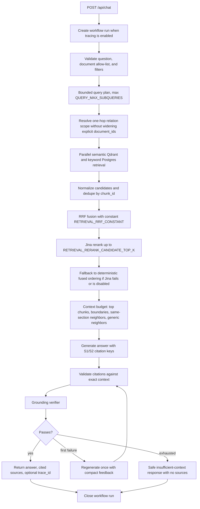

# Backend Local Run

RagDocument backend runs from `backend/` and expects Python 3.12.

## Backend setup

Run these commands from the repository root:

```powershell
cd backend
python -m venv .venv
.\.venv\Scripts\Activate.ps1
pip install -e ".[dev]"
uvicorn app.main:app --reload --port 8000
```

The backend reads its environment from `backend/.env` when present. Keep that file out of version control and use placeholder values only.

## Frontend setup

Run these commands from the repository root:

```powershell
cd frontend
npm install
npm run dev -- --host 127.0.0.1 --port 5173
```

The frontend reads `VITE_API_BASE_URL` and defaults to `http://localhost:8000` if it is not set. If you point the frontend at a different backend, set that variable before starting Vite.

If you use the exact frontend host above (`127.0.0.1`), set `FRONTEND_ORIGIN=http://127.0.0.1:5173` in the backend environment so CORS matches. The plan default `http://localhost:5173` also works if you run Vite on `localhost` instead.

## Required external setup for live E2E

- For a fresh project, run [docs/database/supabase_schema.sql](../docs/database/supabase_schema.sql) in Supabase.
- For an existing Phase 2 project, back up the Supabase database first, confirm you are using the intended project, then run [docs/database/phase3_migration.sql](../docs/database/phase3_migration.sql) with an authorized service role or SQL editor session. Do not paste service keys into chat, reports, frontend code, or committed files.
- Create a Supabase Storage bucket named `documents`.
- Create Qdrant collection `document_chunks_v1` with the embedding dimension returned by the configured ShopAIKey embedding model.
- Set the backend environment variables in `backend/.env` or your shell.
- Keep `ADMIN_API_TOKEN` empty for local-only use, or set it to a long random value and send it as `X-Admin-API-Token` on protected requests.

After applying Phase 3 SQL, reindex existing documents with `POST /api/documents/{document_id}/reindex`. Existing vectors and chunks do not have the new MIME payloads, summaries, relations, and Phase 3 metadata until reindexing completes.

Live end-to-end validation stays blocked until the schema, bucket, collection, reindex scope, and real API keys are in place.

## Modular Architecture & Refactored Services

To support scalability and preserve monkeypatch compatibility in tests, backend services and orchestration steps have been decoupled into focused sub-modules:

1. **Decoupled LangGraph Steps**:
   - **Query Steps**: Chunks of query execution logic are split under [backend/app/graphs/query_steps/](file:///C:/Users/ACER/OtherProjects/DocumentAgent/backend/app/graphs/query_steps/) including:
     - [prepare.py](file:///C:/Users/ACER/OtherProjects/DocumentAgent/backend/app/graphs/query_steps/prepare.py): Normalization of filters and input parameters.
     - [planning.py](file:///C:/Users/ACER/OtherProjects/DocumentAgent/backend/app/graphs/query_steps/planning.py): Query planning and routing.
     - [retrieval.py](file:///C:/Users/ACER/OtherProjects/DocumentAgent/backend/app/graphs/query_steps/retrieval.py): Chunk candidates extraction.
     - [answering.py](file:///C:/Users/ACER/OtherProjects/DocumentAgent/backend/app/graphs/query_steps/answering.py): Model invocation and synthesis.
     - [verification.py](file:///C:/Users/ACER/OtherProjects/DocumentAgent/backend/app/graphs/query_steps/verification.py): Grounding and citation checks.
     - [persistence.py](file:///C:/Users/ACER/OtherProjects/DocumentAgent/backend/app/graphs/query_steps/persistence.py): Graph state storage logic.
   - **Ingestion Steps**: Modular nodes under [backend/app/graphs/ingestion_steps/](file:///C:/Users/ACER/OtherProjects/DocumentAgent/backend/app/graphs/ingestion_steps/) manage document processing phases (e.g., parsing, chunking, summarization, relations, and Qdrant indexing).

2. **Decoupled Retrieval Internals**:
   - **Facade Compatibility Layer**: The main entrypoint [backend/app/services/retrieval.py](file:///C:/Users/ACER/OtherProjects/DocumentAgent/backend/app/services/retrieval.py) acts as a facade, resolving clients dynamically to preserve monkeypatches used by E2E test suites, then forwarding execution to internal helper modules:
     - [retrieval_normalization.py](file:///C:/Users/ACER/OtherProjects/DocumentAgent/backend/app/services/retrieval_normalization.py): Normalizes Qdrant points, UUIDs, text values, and JSON structures.
     - [retrieval_filters.py](file:///C:/Users/ACER/OtherProjects/DocumentAgent/backend/app/services/retrieval_filters.py): Builds native Qdrant payloads, page range bounds, and MIME filters.
     - [semantic_retrieval.py](file:///C:/Users/ACER/OtherProjects/DocumentAgent/backend/app/services/semantic_retrieval.py): Orchestrates embedding generation and semantic similarity searches.
     - [reranking.py](file:///C:/Users/ACER/OtherProjects/DocumentAgent/backend/app/services/reranking.py): Manages Jina reranker client post-processing and diverse selection.

## Phase 2 behavior

The backend now supports the Phase 2 settings and parser behavior documented in the master plan.

- `CHUNKING_STRATEGY=smart_section` is the default. It uses detected headings and table boundaries to write `heading` and `section_path` metadata. `CHUNKING_STRATEGY=fixed_token` preserves the Phase 1 chunking path.
- `HEADER_SCORE_THRESHOLD=4` controls when paragraph-like blocks are promoted to headings during smart section chunking.
- `TABLE_CHUNK_MAX_TOKENS=500` keeps small tables intact and lets larger tables fall back to fixed-token splitting.
- `RETRIEVAL_CONTEXT_MODE=section_aware` is the default retrieval mode. `RETRIEVAL_CONTEXT_MODE=neighbor` keeps the older same-document neighbor expansion.
- `RETRIEVAL_SECTION_SIBLING_WINDOW=1` controls how many same-section neighbors are preferred on each side before generic neighbors are added.
- HTML uploads are supported for `.html` and `.htm` files with `text/html`. The parser keeps visible headings, paragraphs, lists, blockquotes, code, and tables, and ignores scripts, styles, and other hidden elements.
- Existing documents indexed before smart section chunking was enabled should be re-indexed so their stored chunks and source citations gain the new heading metadata.

## Backend environment variables

Copy [backend/.env.example](file:///C:/Users/ACER/OtherProjects/DocumentAgent/backend/.env.example) to `.env`, then replace the service placeholders with your own values. [backend/.env.example](file:///C:/Users/ACER/OtherProjects/DocumentAgent/backend/.env.example) is the single active reference for backend environment variables; this README intentionally does not duplicate those values.

## Phase 3 query and trace architecture



Trace events store node names, status, attempts, timings, providers, counts, routes, fallbacks, safe error codes, retrieval totals, citation validity, and grounding score. They must not store raw chunk text, parsed text, prompts, full model responses, full generated answers, authorization headers, API keys, or credential-bearing URLs.

## Phase 3 API endpoints

All API paths are prefixed with `/api`.

| Method | Endpoint | Notes |
|---|---|---|
| `GET` | `/documents/{document_id}/summaries` | Lists stored section and document summaries through the documents router; no route-level admin-token dependency is currently applied. |
| `GET` | `/documents/{document_id}/relations` | Lists bounded canonical relations for the document through the documents router; no route-level admin-token dependency is currently applied. |
| `GET` | `/observability/runs?workflow_type=&status=&limit=50` | Requires `X-Admin-API-Token`; limit is clamped to `1..100`; newest first. |
| `GET` | `/observability/runs/{run_id}` | Requires `X-Admin-API-Token`; returns `404` for missing runs. |

When `ADMIN_API_TOKEN` is empty, the application is suitable only for local/private single-user operation. When it is set, observability requests must include `X-Admin-API-Token: <token>`. The summary and relation inspection endpoints currently follow the same exposure as the rest of the documents router.

## Operations

Existing-project upgrade:

1. Back up the Supabase project and confirm the target project.
2. Apply [docs/database/phase3_migration.sql](../docs/database/phase3_migration.sql) once through an authorized SQL path.
3. Confirm the `documents.error_code` column, `document_summaries`, `document_relations`, `workflow_runs`, keyword index, and `search_document_chunks_keyword` RPC exist.
4. Reindex existing documents with `POST /api/documents/{document_id}/reindex` so Qdrant MIME payloads, summaries, relations, and metadata are rebuilt.
5. Inspect `/api/documents/{document_id}/summaries`, `/api/documents/{document_id}/relations`, and `/api/observability/runs`.

Fresh setup:

1. Run [docs/database/supabase_schema.sql](../docs/database/supabase_schema.sql).
2. Create the private Supabase Storage bucket and Qdrant collection.
3. Configure backend secrets in `backend/.env`.
4. Upload documents, then index or reindex through the API/UI.

Retryable failures are limited to timeouts, connection failures, HTTP 429, and HTTP 5xx. Validation errors, unsupported files, missing documents, contract errors, and non-retryable 4xx failures run once. Final fallbacks are deterministic: planner failure becomes one original-question hybrid/semantic plan; single retrieval-path failure uses the surviving path; relation failure returns to normal scoped hybrid retrieval; Jina failure uses fused ordering; grounding failure regenerates once and then returns the safe insufficient-context response; message and trace persistence failures log warnings without changing a valid answer.

## Limits and security

RagDocument remains a personal single-user system. It does not implement login, signup, OAuth, Supabase Auth, users, organizations, roles, tenants, or access-control tables. Keep it local/private or protect a deployment with `ADMIN_API_TOKEN`, Cloudflare Access, Tailscale, or a private VPN.

Only extractable text is supported. OCR, scanned PDFs, screenshots, image-only documents, image/chart captioning, audio/video extraction, and PPTX parsing are out of scope. Empty extracted text fails with `NO_EXTRACTABLE_TEXT`.
