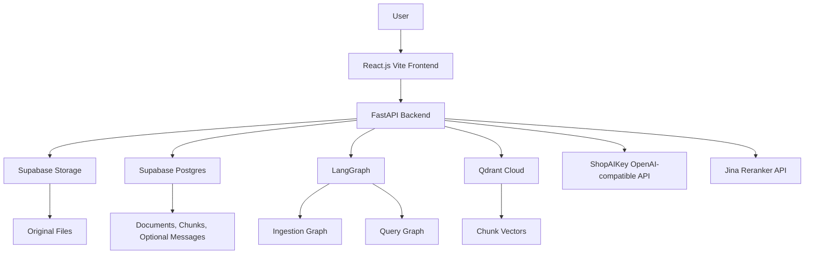
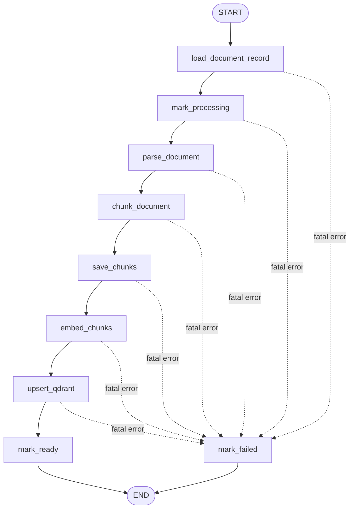
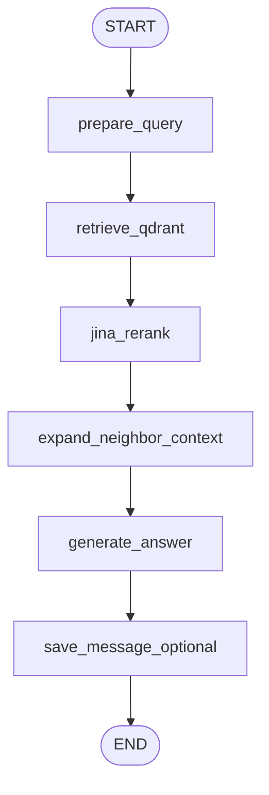

# RagDocument MVP Architecture with LangGraph

> Version: MVP v1.1  
> Scope: Personal single-user RAG application  
> Frontend: React.js with Vite  
> Backend: FastAPI  
> Workflow: LangGraph for ingestion and query orchestration  
> Goal: Build a practical single-user document RAG system without multi-user authentication or enterprise SaaS complexity.

---

## 1. Project Scope

RagDocument is a personal document question-answering system for one user.

The MVP should allow the user to:

- Upload documents.
- Store original files in Supabase Storage.
- Track document metadata and processing status in Supabase Postgres.
- Index documents through a simple LangGraph ingestion graph.
- Parse PDF, DOCX, TXT, and Markdown files.
- Split extracted text into fixed-size chunks.
- Store chunks in Supabase Postgres.
- Generate embeddings through ShopAIKey OpenAI-compatible API.
- Store vectors in Qdrant Cloud.
- Ask questions over all ready documents or selected documents.
- Retrieve relevant chunks from Qdrant.
- Rerank retrieved chunks with Jina.
- Add simple previous/next neighbor chunks for context.
- Generate answers using only retrieved context.
- Return source citations with every grounded answer.

This is **not** a multi-user SaaS system. Do not add login, signup, OAuth, user profiles, organizations, roles, tenant isolation, or access-control tables.

---

## 2. MVP Design Principles

### 2.1. Single-User by Default

Default deployment assumption:

```text
Local-only usage.
```

If the backend is deployed publicly, protect it with one simple private gate:

```http
X-Admin-API-Token: change-this-long-random-secret
```

Alternative deployment protection:

```text
Cloudflare Access
Tailscale
Private VPN
```

Do not build a full authentication system.

---

### 2.2. Keep LangGraph, But Keep It Practical

LangGraph remains a core feature of the MVP.

Use LangGraph for:

- Ingestion orchestration.
- Query orchestration.
- State transitions.
- Error routing.
- Workflow observability.
- Future extensibility.

Do not use LangGraph for:

- Autonomous agents.
- Multi-agent workflows.
- Query decomposition in MVP.
- Relation graph extraction in MVP.
- Complex planning loops.
- Tool-heavy agent behavior.

The MVP graphs should be deterministic, simple, and easy to debug.

---

## 3. Technology Stack

| Layer | Technology |
|---|---|
| Frontend | React.js with Vite |
| Backend | FastAPI |
| Workflow orchestration | LangGraph |
| Original file storage | Supabase Storage |
| Metadata database | Supabase Postgres |
| Vector database | Qdrant Cloud |
| Embeddings | ShopAIKey OpenAI-compatible API |
| Chat model | ShopAIKey OpenAI-compatible API |
| Reranking | Jina Reranker API |
| MVP parsers | PDF, DOCX, TXT, Markdown |
| MVP chunking | Fixed token chunking, 500 tokens, 150 overlap |
| Citations | Source chunks returned with each answer |

---

## 4. High-Level Architecture



---

## 5. Upload vs Indexing Responsibilities

Upload and indexing are separate operations.

This is important because upload is an I/O operation that stores the original file, while indexing is a processing workflow that can fail, be retried, or be re-run later.

---

## 6. Upload Flow

Endpoint:

```http
POST /api/documents/upload
```

Upload flow:

```text
POST /api/documents/upload
→ validate file
→ compute file_hash
→ check duplicate file_hash
→ store original file in Supabase Storage
→ create document row with status = uploaded
→ return document_id
```

The upload endpoint does **not** run the LangGraph ingestion graph.

The upload endpoint should only:

- Validate the file.
- Compute hash.
- Prevent duplicate uploads.
- Store file.
- Create document metadata row.
- Return the document ID.

---

### 6.1. Upload Validation

Validate:

```text
file is not empty
file size <= MAX_UPLOAD_BYTES
file type is supported
file extension matches expected type when possible
```

MVP supported file types:

```text
PDF
DOCX
TXT
Markdown
```

Move later:

```text
HTML
PPTX
OCR for scanned PDFs
Image/chart extraction
```

---

### 6.2. Duplicate Upload Behavior

Use `file_hash`.

MVP behavior:

```text
If a document with the same file_hash already exists:
    return the existing document_id and status
    do not upload duplicate file
    do not create duplicate document row
    do not create duplicate chunks
    do not create duplicate Qdrant vectors
```

Example response for duplicate file:

```json
{
  "document_id": "existing-document-uuid",
  "status": "ready",
  "duplicate": true
}
```

Future optional behavior:

```text
Allow duplicate upload with a new title if the user explicitly wants multiple logical entries for the same file.
```

Do not implement duplicate logical copies in MVP.

---

### 6.3. Upload Response

Example:

```json
{
  "document_id": "9ec6d22c-8b20-4e40-98e1-395fca9275f9",
  "status": "uploaded",
  "duplicate": false
}
```

---

## 7. Indexing Flow

Endpoint:

```http
POST /api/documents/{document_id}/index
```

Indexing flow:

```text
POST /api/documents/{document_id}/index
→ run LangGraph ingestion graph from the stored original file
→ mark document as processing
→ parse
→ chunk
→ save chunks
→ embed
→ upsert Qdrant
→ mark ready
```

The LangGraph ingestion graph assumes that the document row already exists and that the original file has already been stored in Supabase Storage.

The graph should **not** handle initial upload or document row creation.

---

## 8. LangGraph Ingestion Graph

### 8.1. Ingestion Graph Flow

```text
START
→ load_document_record
→ mark_processing
→ parse_document
→ chunk_document
→ save_chunks
→ embed_chunks
→ upsert_qdrant
→ mark_ready
→ END
```

Failure path:

```text
Any fatal error
→ mark_failed
→ END
```

Mermaid:



---

### 8.2. IngestionState

Do not pass large PDFs, DOCX files, or binary blobs around inside LangGraph state.

The original file is stored in Supabase Storage during upload. The ingestion graph should keep only identifiers and metadata. The `parse_document_node` downloads or streams the file from Supabase Storage when needed.

```python
from typing import TypedDict, Optional, Any

class IngestionState(TypedDict, total=False):
    # Required input
    document_id: str

    # Loaded from Supabase document row
    document_record: dict
    storage_path: str
    file_name: str
    mime_type: str
    file_size: int
    file_hash: str

    # Parsed document
    parsed_document: dict
    total_pages: int
    parser_name: str
    parser_version: str

    # Chunking
    chunks: list[dict]
    total_chunks: int
    chunking_strategy: str
    chunking_version: str

    # Embeddings / Qdrant
    embeddings: list[list[float]]
    embedding_model: str
    embedding_dimension: int
    qdrant_collection: str

    # Status / errors
    status: str
    error_message: Optional[str]
```

Removed from graph state:

```text
original_file_bytes
upload_file_path
large binary data
```

`upload_file_path` should only exist inside the upload handler if needed temporarily. It should not be part of persistent graph state.

---

### 8.3. Ingestion Node Responsibilities

#### `load_document_record_node`

Input:

```python
{"document_id": "..."}
```

Responsibilities:

```text
fetch document row from Supabase
validate document exists
load storage_path, file_name, mime_type, file_hash, existing status
```

Failure:

```text
document not found → mark_failed or return 404 from API layer
missing storage_path → mark_failed
```

---

#### `mark_processing_node`

Responsibilities:

```text
update documents.status = processing
clear previous error_message
```

This node starts the indexing process.

---

#### `parse_document_node`

Responsibilities:

```text
download or stream original file from Supabase Storage using storage_path
select parser by mime_type/file extension
extract text
extract page information where available
return normalized parsed_document
```

Parser output:

```python
{
    "text": "full extracted text",
    "pages": [
        {
            "page_number": 1,
            "text": "page text"
        }
    ],
    "metadata": {
        "parser_name": "pymupdf",
        "parser_version": "1.0.0"
    }
}
```

Failure:

```text
parser failure → mark_failed
empty extracted text → mark_failed
unsupported file type → mark_failed
```

---

#### `chunk_document_node`

MVP behavior:

```text
fixed token chunking
chunk size = 500
overlap = 150
step = 350
```

Output:

```python
{
    "chunks": [...],
    "chunking_strategy": "fixed_token",
    "chunking_version": "v1",
    "total_chunks": 42
}
```

Smart section chunking belongs in Phase 2.

---

#### `save_chunks_node`

Responsibilities:

```text
delete existing chunks for document if indexing is being re-run
insert new document_chunks rows
attach generated chunk IDs back to state
```

This node must run before `upsert_qdrant` because Qdrant payload needs `chunk_id`.

---

#### `embed_chunks_node`

Responsibilities:

```text
call ShopAIKey embeddings endpoint
embed chunk content
store embedding_model and embedding_dimension in state
```

Failure:

```text
ShopAIKey timeout or error → mark_failed
embedding dimension missing or invalid → mark_failed
```

---

#### `upsert_qdrant_node`

Responsibilities:

```text
create one Qdrant point per chunk
include chunk metadata and text in payload
save qdrant_point_id back to Supabase document_chunks
```

Failure:

```text
Qdrant upsert error → mark_failed
```

---

#### `mark_ready_node`

Responsibilities:

Update the document row:

```text
status = ready
total_pages
total_chunks
parser_name
parser_version
chunking_strategy
chunking_version
embedding_model
embedding_dimension
qdrant_collection
indexed_at = now()
error_message = null
```

---

#### `mark_failed_node`

Responsibilities:

```text
status = failed
error_message = clear failure reason
```

Do not hide failure details. The frontend should be able to show a useful error.

---

## 9. MVP Query Flow

Endpoint:

```http
POST /api/chat
```

Question answering flow:

```text
User asks question
→ LangGraph query graph starts
→ prepare query
→ embed question
→ retrieve Top 40 from Qdrant
→ rerank Top 5 with Jina
→ optionally add previous/next neighbor chunks
→ generate answer using only retrieved context
→ return answer with sources
```

---

## 10. LangGraph Query Graph

### 10.1. Query Graph Flow

```text
START
→ prepare_query
→ retrieve_qdrant
→ jina_rerank
→ expand_neighbor_context
→ generate_answer
→ save_message_optional
→ END
```

Mermaid:



No MVP nodes for:

```text
query classification
query decomposition
relation graph expansion
grounding verification
```

---

### 10.2. QueryState

```python
from typing import TypedDict, Optional

class QueryState(TypedDict, total=False):
    # Request
    question: str
    document_ids: list[str]
    save_message: bool

    # Prepared query
    prepared_query: str
    query_embedding: list[float]

    # Retrieval
    retrieved_chunks: list[dict]
    reranked_chunks: list[dict]
    context_chunks: list[dict]

    # Generation
    answer: str
    sources: list[dict]

    # Error handling
    error_message: Optional[str]
```

---

### 10.3. Query Node Responsibilities

#### `prepare_query_node`

Responsibilities:

```text
trim whitespace
validate non-empty question
normalize document_ids
set prepared_query = question
```

No query rewriting, classification, or decomposition in MVP.

---

#### `retrieve_qdrant_node`

Responsibilities:

```text
embed prepared_query using ShopAIKey
retrieve top RETRIEVAL_SEMANTIC_TOP_K from Qdrant
support optional document_id filtering
return retrieved chunks with Qdrant scores
```

Default:

```env
RETRIEVAL_SEMANTIC_TOP_K=40
```

If `document_ids` is omitted or empty:

```text
search all ready documents
```

If `document_ids` is provided:

```text
apply Qdrant payload filter:
document_id in document_ids
```

---

#### `jina_rerank_node`

Responsibilities:

```text
send retrieved chunks to Jina
keep top RETRIEVAL_FINAL_TOP_K
fallback to Qdrant score sorting if Jina fails
```

Default:

```env
RETRIEVAL_FINAL_TOP_K=5
```

---

#### `expand_neighbor_context_node`

Responsibilities:

```text
always keep top reranked chunks
for each top chunk, fetch previous/next chunks using document_id + chunk_index
deduplicate chunks
do not exceed RETRIEVAL_CONTEXT_MAX_CANDIDATES
prefer reranked chunks over neighbor chunks
```

Default:

```env
RETRIEVAL_CONTEXT_WINDOW=1
RETRIEVAL_CONTEXT_MAX_CANDIDATES=8
```

---

#### `generate_answer_node`

Responsibilities:

```text
build context from context_chunks
call ShopAIKey chat model
force answer to use only retrieved context
return answer and source citations
```

---

#### `save_message_optional_node`

Responsibilities:

```text
if save_message = true:
    insert question, answer, sources, metadata into messages
else:
    do nothing
```

Message saving failure should not fail the chat response.

---

## 11. Retrieval Configuration

Use these MVP defaults:

```env
RETRIEVAL_SEMANTIC_TOP_K=40
RETRIEVAL_FINAL_TOP_K=5
RETRIEVAL_CONTEXT_WINDOW=1
RETRIEVAL_CONTEXT_MAX_CANDIDATES=8
```

Why:

```text
Qdrant retrieves 40 semantic candidates.
Jina reranks to the 5 strongest chunks.
Neighbor expansion can add up to 3 surrounding chunks.
Final context remains capped at 8 chunks.
```

This avoids the previous conflict where `RETRIEVAL_FINAL_TOP_K=8` and `RETRIEVAL_CONTEXT_MAX_CANDIDATES=8` left no room for neighbors.

---

## 12. Optional Document Filtering in Chat

### 12.1. Chat Request

```json
{
  "question": "What does this document say about pricing?",
  "document_ids": ["uuid-1", "uuid-2"],
  "save_message": true
}
```

### 12.2. Behavior

If `document_ids` is empty or omitted:

```text
search all ready documents
```

If `document_ids` is provided:

```text
search only those documents
```

Qdrant retrieval should apply document ID filtering using payload filters.

---

### 12.3. Qdrant Payload Filtering

Conceptual filter:

```python
Filter(
    must=[
        FieldCondition(
            key="document_id",
            match=MatchAny(any=document_ids),
        )
    ]
)
```

If the Qdrant client version does not support `MatchAny`, use equivalent `should` conditions or retrieve per document and merge results.

---

## 13. Neighbor Context Expansion

For MVP, replace relation graph expansion with neighbor expansion.

### 13.1. Rules

```text
Always keep top reranked chunks.
For each top chunk, optionally fetch chunk_index - 1 and chunk_index + 1 from the same document.
Deduplicate chunks.
Do not exceed RETRIEVAL_CONTEXT_MAX_CANDIDATES.
Prefer reranked chunks over neighbor chunks.
```

---

### 13.2. Pseudo-Code

```python
def expand_neighbor_context_node(state: QueryState):
    reranked = state["reranked_chunks"]
    max_candidates = settings.RETRIEVAL_CONTEXT_MAX_CANDIDATES
    window = settings.RETRIEVAL_CONTEXT_WINDOW

    selected = []
    seen = set()

    # Keep reranked chunks first.
    for chunk in reranked:
        chunk_id = chunk["chunk_id"]
        if chunk_id not in seen:
            selected.append(chunk)
            seen.add(chunk_id)

        if len(selected) >= max_candidates:
            return {"context_chunks": selected}

    # Add neighbors after top reranked chunks.
    for chunk in reranked:
        if len(selected) >= max_candidates:
            break

        document_id = chunk["document_id"]
        chunk_index = chunk["chunk_index"]

        neighbor_indexes = []
        for offset in range(1, window + 1):
            if chunk_index - offset >= 0:
                neighbor_indexes.append(chunk_index - offset)
            neighbor_indexes.append(chunk_index + offset)

        neighbors = fetch_chunks_by_document_and_indexes(
            document_id=document_id,
            indexes=neighbor_indexes,
        )

        for neighbor in neighbors:
            if len(selected) >= max_candidates:
                break

            neighbor_id = neighbor["chunk_id"]
            if neighbor_id in seen:
                continue

            neighbor["is_neighbor_context"] = True
            selected.append(neighbor)
            seen.add(neighbor_id)

    return {"context_chunks": selected}
```

---

## 14. Supabase Storage Design

### 14.1. Bucket

```env
SUPABASE_STORAGE_BUCKET=documents
```

### 14.2. Storage Path

```text
documents/{document_id}/original/{file_name}
```

Example:

```text
documents/9ec6d22c/original/report.pdf
```

The path should be stored in:

```text
documents.storage_path
```

---

## 15. Supabase Postgres Schema

Use only these MVP tables:

```text
documents
document_chunks
messages optional
```

Do not add:

```text
users
profiles
organizations
roles
conversations
document_relations
```

---

### 15.1. `documents` Table

```sql
create table documents (
  id uuid primary key default gen_random_uuid(),
  title text,
  file_name text not null,
  mime_type text,
  file_size bigint,
  file_hash text,
  storage_path text not null,
  status text default 'uploaded',
  total_pages int,
  total_chunks int default 0,
  parser_name text,
  parser_version text,
  chunking_strategy text,
  chunking_version text,
  embedding_model text,
  embedding_dimension int,
  qdrant_collection text,
  indexed_at timestamptz,
  error_message text,
  created_at timestamptz default now(),
  updated_at timestamptz default now()
);
```

Recommended indexes:

```sql
create index idx_documents_status on documents(status);
create index idx_documents_created_at on documents(created_at desc);
create unique index idx_documents_file_hash on documents(file_hash);
```

The unique `file_hash` index enforces the MVP duplicate upload rule.

---

### 15.2. `document_chunks` Table

```sql
create table document_chunks (
  id uuid primary key default gen_random_uuid(),
  document_id uuid references documents(id) on delete cascade,
  chunk_index int not null,
  content text not null,
  content_hash text,
  token_count int,
  chunk_type text,
  heading text,
  section_path jsonb,
  page_start int,
  page_end int,
  token_start int,
  token_end int,
  qdrant_point_id text,
  metadata jsonb,
  created_at timestamptz default now()
);
```

Recommended indexes:

```sql
create index idx_document_chunks_document_id on document_chunks(document_id);
create unique index idx_document_chunks_doc_index on document_chunks(document_id, chunk_index);
create index idx_document_chunks_qdrant_point_id on document_chunks(qdrant_point_id);
```

---

### 15.3. `messages` Table Optional

Use only if saving Q&A history is needed.

```sql
create table messages (
  id uuid primary key default gen_random_uuid(),
  question text not null,
  answer text not null,
  sources jsonb,
  metadata jsonb,
  created_at timestamptz default now()
);
```

Recommended index:

```sql
create index idx_messages_created_at on messages(created_at desc);
```

---

## 16. Qdrant Collection and Payload

### 16.1. Collection

```env
QDRANT_COLLECTION=document_chunks_v1
```

Use versioned collection names to make future migrations easier.

---

### 16.2. Payload

Each Qdrant point payload should include:

```json
{
  "document_id": "document_uuid",
  "chunk_id": "chunk_uuid",
  "chunk_index": 12,
  "file_name": "report.pdf",
  "heading": null,
  "section_path": [],
  "page_start": 3,
  "page_end": 4,
  "chunk_type": "fixed",
  "token_count": 500,
  "text": "Chunk content..."
}
```

Required payload fields:

```text
document_id
chunk_id
chunk_index
file_name
heading
section_path
page_start
page_end
chunk_type
token_count
text
```

For MVP, keep `text` in the payload so retrieval can build context without always querying Supabase again.

---

## 17. Chunking

### 17.1. MVP Chunking

Use fixed token chunking:

```text
chunk size = 500 tokens
overlap = 150 tokens
step = 350 tokens
```

Environment:

```env
CHUNK_SIZE_TOKENS=500
CHUNK_OVERLAP_TOKENS=150
```

---

### 17.2. Fixed Token Chunking Pseudo-Code

```python
def fixed_token_chunk(text: str, tokenizer, chunk_size: int = 500, overlap: int = 150):
    tokens = tokenizer.encode(text)
    chunks = []
    start = 0
    chunk_index = 0
    step = chunk_size - overlap

    while start < len(tokens):
        end = min(start + chunk_size, len(tokens))
        chunk_tokens = tokens[start:end]
        chunk_text = tokenizer.decode(chunk_tokens)

        chunks.append({
            "chunk_index": chunk_index,
            "content": chunk_text,
            "token_count": len(chunk_tokens),
            "chunk_type": "fixed",
            "heading": None,
            "section_path": [],
            "token_start": start,
            "token_end": end,
        })

        if end >= len(tokens):
            break

        start += step
        chunk_index += 1

    return chunks
```

---

### 17.3. Chunker Interface

Design the chunker interface so smart section chunking can be plugged in later.

```python
class BaseChunker:
    def chunk(self, parsed_document: dict) -> list[dict]:
        raise NotImplementedError


class FixedTokenChunker(BaseChunker):
    def chunk(self, parsed_document: dict) -> list[dict]:
        return fixed_token_chunk(
            text=parsed_document["text"],
            tokenizer=self.tokenizer,
            chunk_size=self.chunk_size,
            overlap=self.overlap,
        )


class SmartSectionChunker(BaseChunker):
    def chunk(self, parsed_document: dict) -> list[dict]:
        # Phase 2
        raise NotImplementedError
```

---

## 18. Future Header Detection

Smart section chunking belongs in Phase 2.

When implemented, use a scoring heuristic:

```text
numbered heading pattern adds score
short standalone line adds score
uppercase adds score
larger/bold font adds score when available
table-of-contents match adds score when available
sentence ending with period subtracts score
classify as heading only above threshold
```

Do not make header detection block the MVP.

---

## 19. Re-indexing Flow

Endpoint:

```http
POST /api/documents/{document_id}/reindex
```

Steps:

```text
1. Fetch document row.
2. Mark document as processing.
3. Delete old Qdrant vectors using document_id payload filter.
4. Delete old chunks from Supabase.
5. Parse original file from Supabase Storage.
6. Chunk document.
7. Save new chunks.
8. Generate embeddings.
9. Upsert new vectors to Qdrant.
10. Update:
    - status = ready
    - total_chunks
    - parser_name
    - parser_version
    - chunking_strategy
    - chunking_version
    - embedding_model
    - embedding_dimension
    - qdrant_collection
    - indexed_at
```

If any fatal step fails:

```text
status = failed
error_message = clear failure reason
```

A safer staged re-index can be added later:

```text
create new chunks/vectors first
switch active version after successful indexing
delete old chunks/vectors after successful switch
```

This is not required for MVP.

---

## 20. Document Deletion Flow

Endpoint:

```http
DELETE /api/documents/{document_id}
```

Steps:

```text
1. Fetch document row.
2. Delete Qdrant vectors by document_id payload filter.
3. Delete original file from Supabase Storage.
4. Delete document row from Supabase.
5. Let cascade delete remove chunks.
6. Optionally mark old message sources as stale.
```

Qdrant deletion should happen before deleting the document row.

Reason:

```text
The document row contains cleanup metadata such as storage_path and qdrant_collection.
If the document row is deleted first, cleanup becomes harder to recover if a later step fails.
```

---

## 21. API Endpoints

### 21.1. Required MVP Endpoints

| Method | Endpoint | Purpose |
|---|---|---|
| POST | `/api/documents/upload` | Upload original document only |
| GET | `/api/documents` | List documents |
| GET | `/api/documents/{document_id}` | Get document details/status |
| POST | `/api/documents/{document_id}/index` | Index uploaded document using LangGraph |
| POST | `/api/documents/{document_id}/reindex` | Rebuild chunks and vectors from original file |
| DELETE | `/api/documents/{document_id}` | Delete document, file, chunks, and vectors |
| POST | `/api/chat` | Ask a question |

---

### 21.2. Optional Endpoints

| Method | Endpoint | Purpose |
|---|---|---|
| GET | `/api/documents/{document_id}/chunks` | Inspect document chunks |
| GET | `/api/messages` | View saved Q&A history |

---

### 21.3. Chat Request

```json
{
  "question": "What does this document say about pricing?",
  "document_ids": ["uuid-1", "uuid-2"],
  "save_message": true
}
```

`document_ids` is optional.

---

### 21.4. Chat Response

```json
{
  "answer": "The document states that pricing is based on usage tiers.",
  "sources": [
    {
      "document_id": "uuid-1",
      "chunk_id": "chunk-uuid",
      "file_name": "pricing.pdf",
      "chunk_index": 12,
      "page_start": 3,
      "page_end": 4,
      "heading": null,
      "qdrant_score": 0.78,
      "rerank_score": 0.91
    }
  ]
}
```

---

## 22. Updated `.env`

```env
APP_ENV=development
FRONTEND_ORIGIN=http://localhost:5173
ADMIN_API_TOKEN=change-this-long-random-secret

SUPABASE_URL=https://your-project.supabase.co
SUPABASE_SERVICE_ROLE_KEY=your-supabase-service-role-key
SUPABASE_STORAGE_BUCKET=documents

SHOPAIKEY_API_KEY=your-key
SHOPAIKEY_BASE_URL=https://api.shopaikey.com/v1
SHOPAIKEY_CHAT_MODEL=gpt-5-mini
SHOPAIKEY_EMBEDDING_MODEL=text-embedding-3-small

QDRANT_URL=https://your-cluster-url.cloud.qdrant.io
QDRANT_API_KEY=your-qdrant-key
QDRANT_COLLECTION=document_chunks_v1

ENABLE_RERANK=true
JINA_API_KEY=your-jina-key
JINA_RERANK_MODEL=jina-reranker-v2-base-multilingual

RETRIEVAL_SEMANTIC_TOP_K=40
RETRIEVAL_FINAL_TOP_K=5
RETRIEVAL_CONTEXT_WINDOW=1
RETRIEVAL_CONTEXT_MAX_CANDIDATES=8

CHUNK_SIZE_TOKENS=500
CHUNK_OVERLAP_TOKENS=150

MAX_UPLOAD_BYTES=25000000
TEMPERATURE=0.2
MAX_OUTPUT_TOKENS=1200
```

Notes:

```text
ADMIN_API_TOKEN is optional for local-only usage.
Never expose service/API keys in the frontend.
```

---

## 23. Error Handling

### 23.1. Upload Errors

| Error | Behavior |
|---|---|
| Unsupported file type | Reject upload |
| File too large | Reject upload |
| Empty file | Reject upload |
| Duplicate file_hash | Return existing document_id and status |
| Supabase Storage upload failure | Return upload error, do not create document row if possible |

---

### 23.2. Ingestion Errors

| Error | Behavior |
|---|---|
| Document row not found | Return 404 or mark failed if graph already started |
| Missing storage_path | Mark failed |
| Parser failure | Mark failed |
| Empty parsed text | Mark failed |
| Chunking failure | Mark failed |
| Embedding failure | Mark failed |
| Qdrant upsert failure | Mark failed |

If ingestion fails:

```text
documents.status = failed
documents.error_message = clear reason
```

---

### 23.3. Query Errors

| Error | Behavior |
|---|---|
| Empty question | Return validation error |
| No retrieved chunks | Return "No relevant information found in indexed documents." |
| Jina timeout/failure | Fallback to Qdrant score sorting |
| ShopAIKey chat failure | Return API error |
| Message save failure | Log warning, still return answer |

---

## 24. LangGraph Code Skeleton

### 24.1. Ingestion Graph

```python
from langgraph.graph import StateGraph, END

def build_ingestion_graph():
    graph = StateGraph(IngestionState)

    graph.add_node("load_document_record", load_document_record_node)
    graph.add_node("mark_processing", mark_processing_node)
    graph.add_node("parse_document", parse_document_node)
    graph.add_node("chunk_document", chunk_document_node)
    graph.add_node("save_chunks", save_chunks_node)
    graph.add_node("embed_chunks", embed_chunks_node)
    graph.add_node("upsert_qdrant", upsert_qdrant_node)
    graph.add_node("mark_ready", mark_ready_node)
    graph.add_node("mark_failed", mark_failed_node)

    graph.set_entry_point("load_document_record")

    graph.add_edge("load_document_record", "mark_processing")
    graph.add_edge("mark_processing", "parse_document")
    graph.add_edge("parse_document", "chunk_document")
    graph.add_edge("chunk_document", "save_chunks")
    graph.add_edge("save_chunks", "embed_chunks")
    graph.add_edge("embed_chunks", "upsert_qdrant")
    graph.add_edge("upsert_qdrant", "mark_ready")
    graph.add_edge("mark_ready", END)
    graph.add_edge("mark_failed", END)

    return graph.compile()
```

Practical error routing pattern:

```python
def has_failed(state: dict) -> bool:
    return state.get("status") == "failed"


def route_after_step(success_node: str):
    def _route(state: dict):
        if has_failed(state):
            return "mark_failed"
        return success_node
    return _route
```

For a minimal MVP, it is also acceptable to wrap graph invocation in a top-level try/except and call `mark_failed_node` from the API handler.

---

### 24.2. Query Graph

```python
from langgraph.graph import StateGraph, END

def build_query_graph():
    graph = StateGraph(QueryState)

    graph.add_node("prepare_query", prepare_query_node)
    graph.add_node("retrieve_qdrant", retrieve_qdrant_node)
    graph.add_node("jina_rerank", jina_rerank_node)
    graph.add_node("expand_neighbor_context", expand_neighbor_context_node)
    graph.add_node("generate_answer", generate_answer_node)
    graph.add_node("save_message_optional", save_message_optional_node)

    graph.set_entry_point("prepare_query")

    graph.add_edge("prepare_query", "retrieve_qdrant")
    graph.add_edge("retrieve_qdrant", "jina_rerank")
    graph.add_edge("jina_rerank", "expand_neighbor_context")
    graph.add_edge("expand_neighbor_context", "generate_answer")
    graph.add_edge("generate_answer", "save_message_optional")
    graph.add_edge("save_message_optional", END)

    return graph.compile()
```

---

## 25. Answer Prompt

System prompt:

```text
You are a personal document RAG assistant.

Rules:
- Answer using only the provided context.
- If the context does not contain enough information, say that the indexed documents do not contain enough information.
- Do not invent facts.
- Do not invent sources.
- Cite the source chunks used in the answer.
- Keep the answer clear and practical.
```

User prompt format:

```text
Context:
{context}

Question:
{question}

Answer using only the context.
```

---

## 26. Source Citation Format

Each returned source should include:

```json
{
  "document_id": "uuid",
  "chunk_id": "uuid",
  "file_name": "report.pdf",
  "chunk_index": 12,
  "page_start": 3,
  "page_end": 4,
  "heading": null,
  "qdrant_score": 0.78,
  "rerank_score": 0.91
}
```

Frontend display:

```text
Source 1: report.pdf, chunk 12, pages 3-4
```

If page numbers are unavailable:

```text
Source 1: report.pdf, chunk 12
```

---

## 27. Project Phases

### Phase 1: Minimal Useful RAG with LangGraph

Tasks:

- [ ] React.js Vite frontend.
- [ ] FastAPI backend.
- [ ] Supabase Storage bucket.
- [ ] Supabase tables: `documents`, `document_chunks`, optional `messages`.
- [ ] Qdrant collection `document_chunks_v1`.
- [ ] `POST /api/documents/upload`.
- [ ] File validation.
- [ ] File hash duplicate detection.
- [ ] Original file storage.
- [ ] Document row creation with `status = uploaded`.
- [ ] `POST /api/documents/{document_id}/index`.
- [ ] LangGraph ingestion graph.
- [ ] PDF parser.
- [ ] DOCX parser.
- [ ] TXT parser.
- [ ] Markdown parser.
- [ ] Fixed token chunking.
- [ ] Chunk saving.
- [ ] ShopAIKey embeddings.
- [ ] Qdrant upsert.
- [ ] Document status updates.
- [ ] `POST /api/chat`.
- [ ] LangGraph query graph.
- [ ] Qdrant Top 40 retrieval.
- [ ] Optional document_id filtering.
- [ ] Jina Top 5 reranking.
- [ ] Neighbor context expansion up to 8 chunks.
- [ ] ShopAIKey answer generation.
- [ ] Source citations.

---

### Phase 2: Usability and Retrieval Quality

Tasks:

- [ ] Document list UI.
- [ ] Document status UI.
- [ ] Source viewer panel.
- [ ] Document deletion.
- [ ] Re-indexing.
- [ ] Chunk inspection endpoint.
- [ ] Message history if useful.
- [ ] Smart section chunking.
- [ ] Header scoring heuristic.
- [ ] Table preservation.
- [ ] Neighbor context tuning.
- [ ] Optional HTML parsing.

---

### Phase 3: Advanced RAG

Tasks:

- [ ] Query decomposition.
- [ ] LLM-based chunk relationship extraction.
- [ ] `document_relations` table.
- [ ] Relation graph expansion.
- [ ] Grounding verification.
- [ ] Hybrid search.
- [ ] OCR.
- [ ] PPTX support.
- [ ] Image/chart captioning.
- [ ] Document summaries.
- [ ] Section summaries.
- [ ] Multi-vector chunks.
- [ ] RAG evaluation dataset.
- [ ] Retrieval quality metrics.
- [ ] Answer faithfulness metrics.

---

## 28. Features Explicitly Not in MVP

Do not implement these in Phase 1:

```text
Supabase Auth
login
signup
OAuth
user profiles
multi-user system
multi-tenant access control
organizations
roles
conversations
document_relations
query classification
query decomposition
LLM relation extraction
grounding verification
OCR
PPTX parsing
image/chart captioning
hybrid search
document summaries
section summaries
multi-vector chunks
autonomous agents
multi-agent workflows
complex planning loops
```

---

## 29. Final MVP Checklist

The MVP is complete when:

- [ ] Upload and indexing are separate.
- [ ] Upload validates file and computes `file_hash`.
- [ ] Duplicate upload returns existing `document_id`.
- [ ] Original file is stored in Supabase Storage.
- [ ] Document row is created with `status = uploaded`.
- [ ] Index endpoint starts LangGraph ingestion graph.
- [ ] Ingestion graph loads existing document record.
- [ ] Ingestion graph does not carry large binary file data in state.
- [ ] Document is marked `processing` during indexing.
- [ ] PDF, DOCX, TXT, and Markdown parsing work.
- [ ] Fixed token chunking uses 500 tokens and 150 overlap.
- [ ] Chunks are saved in Supabase.
- [ ] Embeddings are generated through ShopAIKey.
- [ ] Qdrant vectors are upserted with correct payload.
- [ ] Document is marked `ready`.
- [ ] Fatal ingestion errors mark document as `failed`.
- [ ] Chat endpoint supports optional `document_ids`.
- [ ] Query graph embeds the question.
- [ ] Qdrant retrieves Top 40 candidates.
- [ ] Qdrant filtering by document_id works.
- [ ] Jina reranks to Top 5.
- [ ] Jina failure falls back to Qdrant score.
- [ ] Neighbor expansion can add chunks up to max context 8.
- [ ] Answer uses only retrieved context.
- [ ] Answer returns source citations.
- [ ] Delete endpoint removes Qdrant vectors, file, document row, and chunks.
- [ ] Re-index endpoint rebuilds chunks and vectors from original file.
- [ ] No removed authentication or multi-user concepts exist in the MVP design.

---

## 30. Final Architecture Summary

The corrected MVP architecture is:

```text
React.js Vite frontend
    → upload, document list, chat, source display

FastAPI backend
    → API layer, private secrets, simple optional admin token

Supabase Storage
    → original document files

Supabase Postgres
    → documents, document_chunks, optional messages

LangGraph
    → ingestion graph and query graph

Qdrant Cloud
    → vector search over document chunks

ShopAIKey OpenAI-compatible API
    → embeddings and answer generation

Jina Reranker
    → rerank Qdrant candidates before answer generation
```

The design is intentionally lean. LangGraph stays as the orchestration backbone, but the MVP avoids agents, relation graphs, multi-user authentication, and enterprise patterns until they are actually needed.
